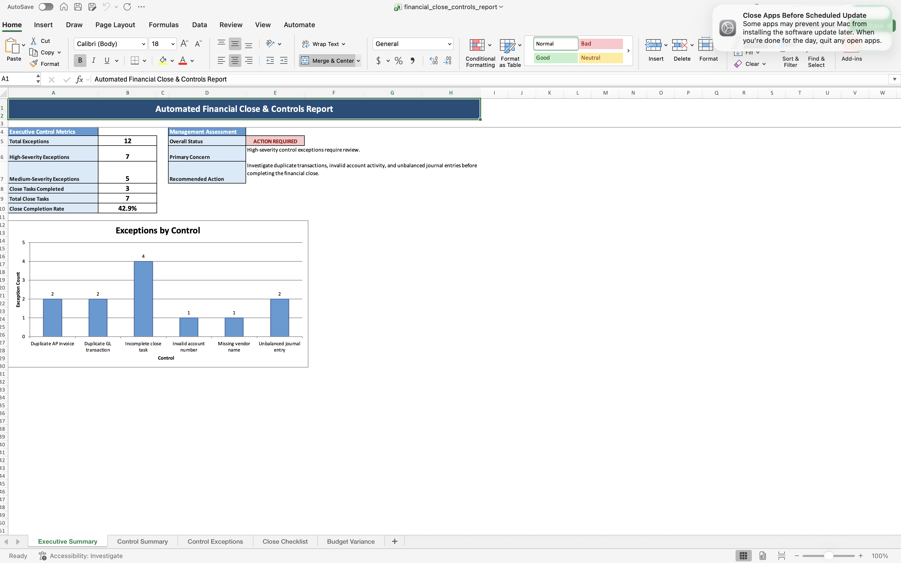
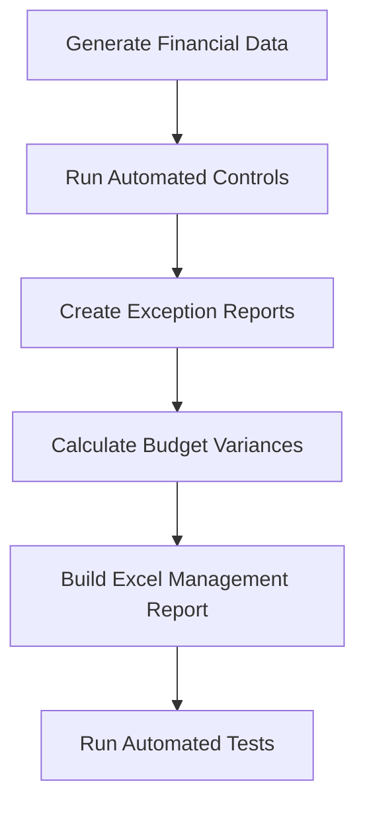

# Automated Financial Close, Controls & Management Reporting Platform

A finance automation project that generates financial data, performs automated accounting control checks, identifies exceptions, and creates a formatted Excel management report.

## Business Problem

Month-end financial reporting often involves manual data validation, journal-entry review, spreadsheet preparation, and follow-up on incomplete close activities.

This project demonstrates how Python can automate these activities while maintaining an auditable record of identified exceptions.

## Solution

The reporting pipeline:

1. Generates realistic fictional financial data.
2. Runs automated accounting and data-quality controls.
3. Creates detailed exception and control-summary files.
4. Tracks month-end close completion.
5. Calculates budget-versus-actual variances.
6. Produces a formatted Excel management report.
7. Records pipeline and control activity in log files.
8. Validates outputs with automated tests.

## Report Preview



## Pipeline Architecture



## Automated Controls

The project currently performs six controls:

- Duplicate general-ledger transaction detection
- Invalid chart-of-accounts detection
- Unbalanced journal-entry detection
- Duplicate accounts-payable invoice detection
- Missing vendor-name detection
- Incomplete month-end close task detection

## Management Report

The generated Excel workbook contains:

- Executive Summary
- Control Summary
- Control Exceptions
- Close Checklist
- Budget Variance

The executive summary provides control metrics, close completion, management status, recommended actions, and an exception chart.

## Technologies

- Python
- pandas
- NumPy
- Faker
- XlsxWriter
- pytest
- Excel
- Git and GitHub

## Project Structure

```text
financial-close-controls-reporting/
├── data/
│   ├── raw/
│   └── processed/
├── logs/
├── reports/
├── src/
│   ├── generate_data.py
│   ├── run_controls.py
│   └── create_reports.py
├── tests/
│   └── test_pipeline_outputs.py
├── run_pipeline.py
├── requirements.txt
├── .gitignore
└── README.md
```

## Run the Project

Create and activate a virtual environment:

```bash
python3 -m venv .venv
source .venv/bin/activate
```

Install the requirements:

```bash
pip install -r requirements.txt
```

Run the complete reporting pipeline:

```bash
python run_pipeline.py
```

Run the automated tests:

```bash
pytest -v
```

## Key Results

The sample control run identifies:

- 12 total exceptions
- 7 high-severity exceptions
- 5 medium-severity exceptions
- 4 incomplete close tasks
- 42.9% close completion rate

All five automated output tests pass successfully.

## Portfolio Skills Demonstrated

- Financial reporting automation
- Month-end close monitoring
- Accounting control design
- Journal-entry validation
- Exception management
- Budget variance analysis
- Excel report generation
- Python workflow automation
- Automated testing
- Audit logging

## Data Notice

All company, vendor, transaction, budget, and accounting data in this project is fictional and generated solely for demonstration purposes.